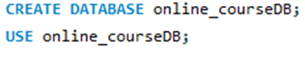

# Finals Lab Task 3.1 - MYSQL Clause

## TASK OVERVIEW
In this exercise, we used MySQL to create a database called online_courseDB. The tasks included establishing the online_course table and running different SELECT queries on it. The following queries were used: to get courses by category and student count; to group and count enrollments by category; to filter courses by enrollment limitations; and to sort the results according to enrollment figures. A SQL copy of the database structure, SQL query statements, and query results were among the final outputs.

## Database Creation

## Courses Table

## Insert Values in Courses Table

# TASK 1 
- Query

- Table Structure

# TASK 2
- Query

- Table Structure

# TASK 3
- Query

- Table Structure

# TASK 4
- Query

- Table Structure

# TASK 5
- Query

- Table Structure

